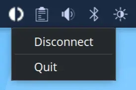

# Outline CLI Tray

## Showcase


### Build
You can use the following command to build.
```
go build -o outline-cli-tray main.go
```

### Run
You can use the following command to run.
```
./outline-cli-tray "ss://<outline-server-access-key>"
```

### References
- https://github.com/getlantern/systray
- https://github.com/Jigsaw-Code/outline-sdk/blob/main/x/examples/outline-cli
